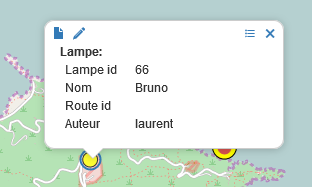

Objets métiers
==============

.. figure:: ../../liste_objets_metier.png
   :alt: image

1. Définition
-------------

Un objet métier est une entité qui associe à un calque, les attributs
d’une table de base de données. De la sorte, les attributs associés au
calque sont affichables et éditables, dans le requêteur et dans le
formulaire de création d’objet, accessibles dans le mode Carte.

Le mode Développement permet l’ajout, l’édition et la suppression
d’objets métier.

La création d’un objet métier s’opère en deux temps :

-  La déclaration de l’objet et des paramètres d’affichage du requêteur.
-  La construction des formulaires d’affichage, de création, d’édition
   et de recherche de l’objet métier via le studio.

2. Création d’un objet métier
-----------------------------

.. figure:: ../../creation_objet_metier.png
   :alt: image

Renseigner les champs suivants :

-  Titre: nom de l’objet métier tel qu’il apparaîtra dans le requêteur
   et dans le formulaire de création d’objet

.. figure:: ../../lampe_requeteur.png
   :alt: Titre de l'objet tel qu'il apparaît dans le requêteur

.. figure:: ../../lampe_creation.png
   :alt: Titre de l'objet tel qu'il apparaît dans le formulaire de
   création d'objet

-  Champs id : champ identifiant de la table.
-  Base de données : nom de la base de données à laquelle se connecter
-  Schéma : schéma de la base de données
-  Table : table de la base de données
-  SQL Summary : requête SQL pour définir les champs à afficher dans
   l’infobulle d’un objet :

-  SQL List : requête SQL pour définir les champs à afficher dans la
   liste des objets sélectionnés d’un requêteur :

.. figure:: ../../liste_requeteur.png
   :alt: image

3. Formulaires
--------------

3.1. Définitions
~~~~~~~~~~~~~~~~

Pour chaque objet métier, plusieurs formulaires sont utilisables et
paramétrables pour plusieurs cas d'utilisation:

3.1.1. Formulaire de recherche de l’objet métier (search)
~~~~~~~~~~~~~~~~~~~~~~~~~~~~~~~~~~~~~~~~~~~~~~~~~~~~~~~~~

Utilisable dans le requêteur et disponible pour les utilisateurs ayant
des **droits en consultation** sur la table liée, il permet de faire des
recherches filtrées sur les enregistrements de l'objet métier.

.. figure:: ../../images/formulaire_search.png
   :alt: image

3.1.2. Formulaire d’affichage de l’objet métier (display)
~~~~~~~~~~~~~~~~~~~~~~~~~~~~~~~~~~~~~~~~~~~~~~~~~~~~~~~~~

Utilisable par les personnes ayant des **droits en consultation** sur la
table liée, il permet d'afficher des informations en consultation pour
l'enregistrement sélectionné.

.. figure:: ../../images/formulaire_display.png
   :alt: image

3.1.3. Formulaire de mise à jour de l’objet métier (update)
~~~~~~~~~~~~~~~~~~~~~~~~~~~~~~~~~~~~~~~~~~~~~~~~~~~~~~~~~~~

Utilisable par les personnes ayant des **droits de mise à jour** sur la
table liée, il permet de mettre à jour les arguments de l'enregistrement
en édition.

.. figure:: ../../images/formulaire_update.png
   :alt: image

3.1.4. Formulaire de création de l’objet métier (insert)
~~~~~~~~~~~~~~~~~~~~~~~~~~~~~~~~~~~~~~~~~~~~~~~~~~~~~~~~

Utilisable par les personnes ayant des **droit en insertion** sur la
table liée et accessible par le bouton **"Éditer les attributs"**, il
permet à l'utilisateur de renseigner les arguments de l'enregistrement à
insérer.

.. figure:: ../../images/formulaire_insert.png
   :alt: image

3.2 Studio
~~~~~~~~~~

Afin d'administrer ces formulaires pouvant être très complexes, nous
avons développé un studio permettant à l'administrateur de gérer
graphiquement les différents formulaires des objets métier.

Pour accéder au studio, il suffit de cliquer sur la section Formulaires
lors de l'édition d'un objet métier.

.. figure:: ../../images/formulaire_studio.png
   :alt: image

3.2.1. Génération automatique des formulaires
^^^^^^^^^^^^^^^^^^^^^^^^^^^^^^^^^^^^^^^^^^^^^

La première chose à faire lorsqu'on veut créer un ensemble de formulaires
est de demander à l'application de les générer en fonction des colonnes
présentes sur la table liée. Si le typage en base de données est bien
fait et que cela est possible, le type de champ affiché dans le
formulaire sera également implémenté (texte, nombre, date etc...).

Pour cela, il suffit de cliquer **confirmer** lors de l'affichage du
message suivant:

.. figure:: ../../images/formulaire_message_creation.png
   :alt: image

Ou bien, dans le **formulaire par défaut** de cliquer sur **Régénérer le
formulaire par défaut**

.. figure:: ../../images/formulaire_reset_default_button.png
   :alt: image

Alors apparaîtra la fenêtre suivante où l'utilisateur peut:

-  Sélectionner les arguments à afficher
-  Changer pour chaque champ le nom qui sera affiché dans le formulaire

.. figure:: ../../images/formulaire_selection_colonnes.png
   :alt: image

3.2.2. Description du studio
^^^^^^^^^^^^^^^^^^^^^^^^^^^^

Le studio est divisé en quatre zones principales permettant la gestion
des formulaires :

3.2.2.1. La zone d'administration du fichier
''''''''''''''''''''''''''''''''''''''''''''

Concrètement la zone la plus importante car elle permet la sauvegarde et
l'affichage des fichiers. Il y a trois types de formulaires : le
**formulaire par défaut** qui est le formulaire généré automatiquement,
le **formulaire publié** qui est le formulaire en cours d'utilisation
dans l'application, et enfin le **formulaire personnalisé** qui est le
formulaire en cours d'édition.

.. figure:: ../../images/formulaire_zone_fichier.png
   :alt: image

Pour modifier un formulaire, l'administrateur se place sur
**Perso**, sélectionne le type de formulaire sur lequel il veut
travailler (display, search, update, insert), édite ce qu'il veut
modifier et enfin **publie le formulaire personnalisé** car sans cela
les modifications ne seront pas visibles par les utilisateurs.

Le menu déroulant **Fichier** donnera la possibilité de gérer les
versions des formulaires (publier le formulaire personnalisé, régénérer
le formulaire par défaut etc..)

Le menu déroulant **Édition** permettra quand à lui d'opérer des actions
d'administration sur le formulaire comme par exemple la **gestion des
onglets**.

3.2.2.2. La zone de prévisualisation
''''''''''''''''''''''''''''''''''''

La zone de prévisualisation permet à l'administrateur de visualiser en
direct le formulaire en cours.

.. figure:: ../../images/formulaire_zone_previsualisation.png
   :alt: image

Il y a également un menu déroulant **Prévisualisation** qui permet
l'affichage et la modification de la définition du formulaire au format
JSON ainsi que l'ajout de JavaScript au formulaire.

**Attention en cas d'utilisation d'onglets : les onglets ne sont
volontairement pas affichés dans cette zone, ils seront affichés lors de
l'utilisation réelle du formulaire**.

3.2.2.3. La zone de gestion de mise en page
'''''''''''''''''''''''''''''''''''''''''''

Dans cette zone l'administrateur peut modifier l'ordre d'affichage des
attributs, et via la case "Voir / modifier les lignes", il peut regrouper plusieurs éléments sur une même ligne.

.. figure:: ../../images/formulaire_zone_attributs.png
   :alt: image

Le bouton **Sources de données** en bas de zone,  permet d'administrer celles-ci. Ces dernières permettront
de remplir les éléments de type liste en allant chercher les données en
base par exemple.

3.2.2.4. La zone de définition de l'attribut sélectionné
''''''''''''''''''''''''''''''''''''''''''''''''''''''''

Dans cette zone, l'administrateur pourra gérer le type de saisie qui
sera faite, le libellé à afficher sur le formulaire, le nom de la
colonne auquel il est lié et bien d'autres paramètres en fonction du
type d'attribut.

.. figure:: ../../images/formulaire_zone_definition.png
   :alt: image

3.2.3. Utilisation du studio
^^^^^^^^^^^^^^^^^^^^^^^^^^^^

Pour comprendre comment utiliser le studio vous pouvez aller voir le
document `Cas concrets d'utilisation du studio dans
vMap <cas_utilisation_studio.html>`__
